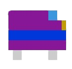
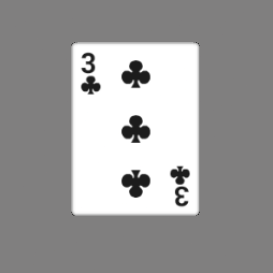
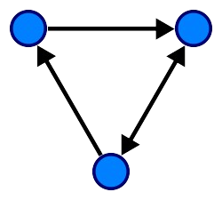
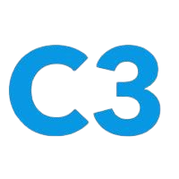
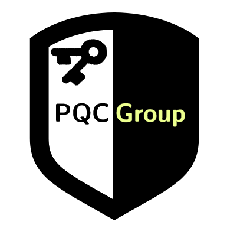
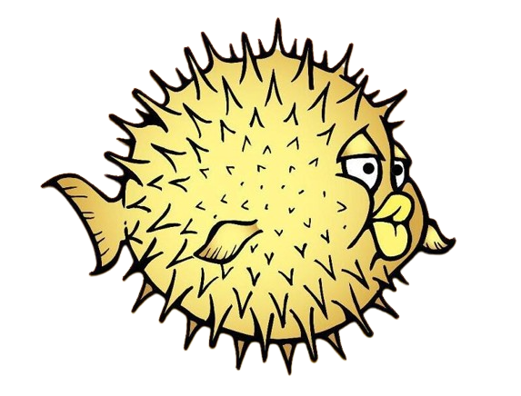
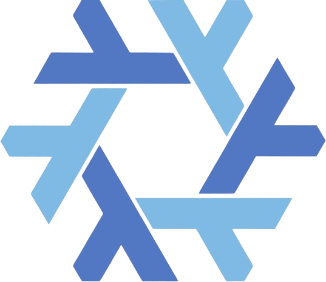
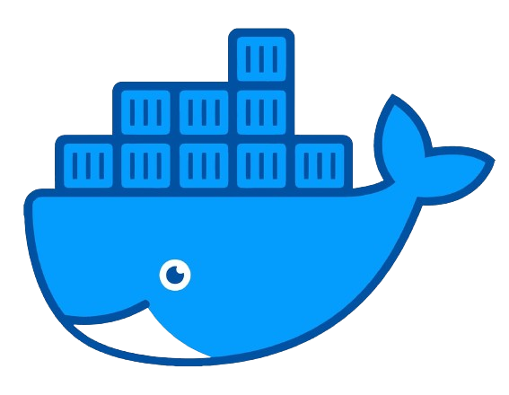

## Social media

## Projects and Repositories

<!---### Stable release (v1.1.0)

    

### Le Frata -tb &nbsp;

<a href="https://github.com/alexandreboutrik/lefrata-tb">Le Frata (-tb)</a> is a fork of a simple game project I developed at college with friends using the ncurses library. This fork aims to migrate the TUI from ncurses to termbox, a better and more versatile alternative.

--->

### Beta release (v1.0.2-beta)

    

### DATCOM Backend &nbsp;

<a href="https://github.com/alexandreboutrik/datcom_backend">This repository</a> contains a REST API backend implementation for the <a href="https://github.com/datcomtd">DATCOM</a> website. The API provides endpoints for user registration, document uploading, and product listings from the DATCOM's store.

---

### Early development phase (pre-alpha)

    

### Homburg &nbsp;&nbsp;,&nbsp;

<a href="https://github.com/alexandreboutrik/homburg">Homburg</a> is a backend solution for creating and managing forum platforms. It features a proof-of-concept authentication system that utilizes asymmetric post-quantum cryptography instead of traditional IDs and passwords, ensuring robust protection against spoofing attacks, including those originating from admins.

---

### Early development phase (pre-alpha)

    

### Arena &nbsp;

<a href="https://github.com/alexandreboutrik/arena">Arena</a> is a collection of Brazilian card games developed in C99 using the Raylib library, currently in its very early development phase. The first alpha release, planned for March 2025, will debut with the popular game Fodinha, with future updates set to include additional games.

---

<!---
---

### Early development phase (pre-alpha)

    

### PAX &nbsp;

<a href="https://github.com/alexandreboutrik/paxium">Pax</a>, or Paxium, is a modern package manager developed in Golang for the <a href="https://www.openbsd.org">OpenBSD</a> operating system. Designed with simplicity and efficiency in mind, Paxium also integrates enhanced features such as support for post-quantum cryptography and a source-based build system (optionally acting as a <a href="https://www.openbsd.org/faq/ports/ports.html">ports</a> frontend). Currently, Paxium is in the pre-alpha design stage.

--->

<!---
### Early development phase (pre-alpha)

    

### AUI &nbsp;

<a href="https://github.com/alexandreboutrik/aui">AUI</a> is a very simple Text-based User Interface (TUI) for Ada written in Ada. It is still in a very early development stage and it lacks technologies like multiple buffers - it writes directly to the standard output using ASCII escape codes.

--->

### Learning purposes

    

### DSA and Maratona-src &nbsp;&nbsp;&nbsp;&nbsp;

Both <a href="https://github.com/alexandreboutrik/dsa">dsa</a> and <a href="https://github.com/alexandreboutrik/maratona-src">maratona-src</a> repositories have learning purposes. I use them to learn more about competitive programming, data structures, algorithms and new languages (by solving problems in that language).

---

## Organizations

### Research group

    

### PQC Group (Post-Quantum Cryptography at UTFPR-TD)

The mission of <a href="https://pqc-group-utfpr.github.io/index.html">this research group</a> is to contribute to Post-Quantum Cryptography (PQC) by studying concepts, applications and adoption strategies, focusing on - but not restricted to - the development and evaluation of PQC in network protocols.  
Currently working on the <a href="https://pqc-group-utfpr.github.io/projects.html">BBPQ</a> project.  

:book:&nbsp;&nbsp;Articles:  
- 2024-2025: _Two articles upcoming: one from the BBPQ project; one related to RSA_.  
- 2023-2024: Generating KEM certificates using the ACME protocol (doi:10.29327/seisicite2024.966085).

---

## Technologies

### Languages:

| C99 | Ada | Go | Python | Haskell | Fasm | Perl |
|:---:|:---:|:--:|:------:|:-------:|:----:|:----:|
|  |  |  |  |  |  |  |

### OS:

| Gentoo | OBSD | NixOS |
|:------:|:----:|:-----:|
|  |  |  |

### Other:

| Django | AdaWS | Gin | Git | PSQL | Docker |
|:------:|:-----:|:---:|:---:|:----:|:------:|
|  |  |  |  |  |  |

---

### Github stats:

    
&nbsp;
&nbsp;
    

