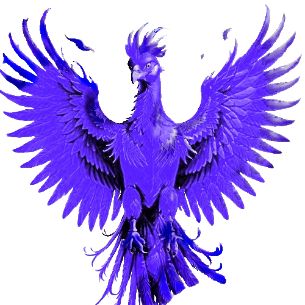

## Social media

---

## Technologies

### Languages:

| C99 | Ada | Rust | Python | Perl |
|:---:|:---:|:------:|:----:|:----:|
|  |  |  |  |  |

### OS:

| Gentoo | OBSD | NixOS |
|:------:|:----:|:-----:|
|  |  |  |

### Other:

| Django | AdaWS | Git | PSQL | Docker |
|:------:|:-----:|:---:|:----:|:------:|
|  |  |  |  |  |

---

## Public Projects and Repositories

### Stable release

    

### Le Frata -tb &nbsp;

<a href="https://github.com/alexandreboutrik/lefrata-tb">Le Frata (-tb)</a> is a fork of a game project I developed at college with friends using the ncurses library. This fork aims to migrate the TUI from ncurses to termbox, a better and more versatile alternative.

---

    

### DSA and Maratona-src &nbsp;&nbsp;

Both <a href="https://github.com/alexandreboutrik/dsa">dsa</a> and <a href="https://github.com/alexandreboutrik/maratona-src">maratona-src</a> repositories have learning purposes. I use them to learn more about competitive programming, data structures, algorithms and new languages (by solving problems in that language).

---

### Early development phase

    

### Phoenix BC &nbsp;  

<a href="https://github.com/alexandreboutrik/phoenix-bc">Phoenix BC</a> is a tool designed to verify if a program's behavior matches expected outputs. It executes automated tests by providing specific inputs and comparing the generated outputs against the expected results.

---

    

### AUI &nbsp;

<a href="https://github.com/alexandreboutrik/aui">AUI</a> is a very simple Text-based User Interface (TUI) for Ada written in Ada. It is still in a very early development stage and it lacks technologies like multiple buffers - it writes directly to the standard output using ASCII escape codes.

---

### Github stats:

    
&nbsp;
&nbsp;
    

