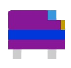
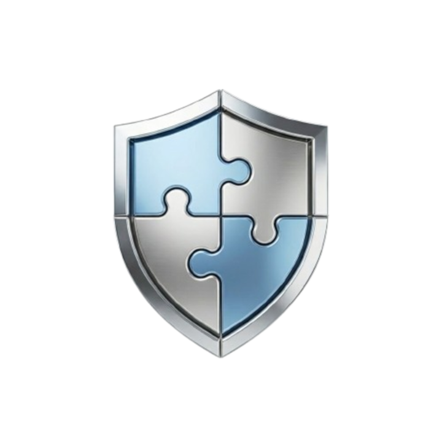
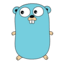
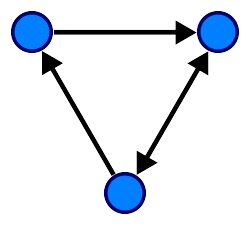
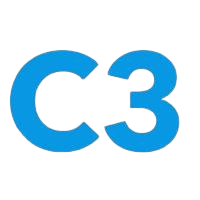
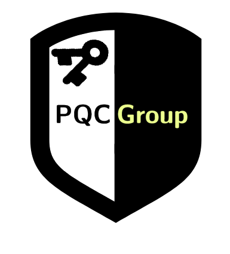
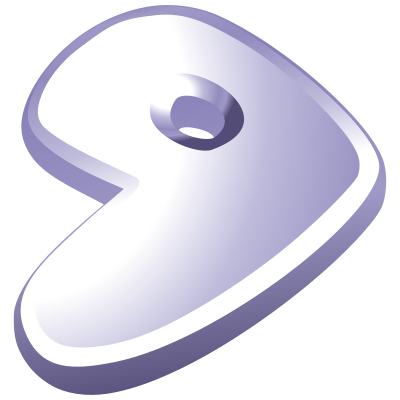
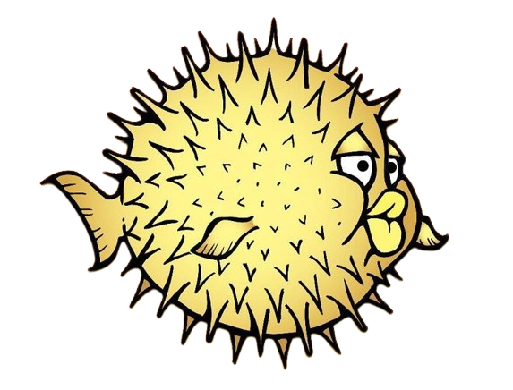
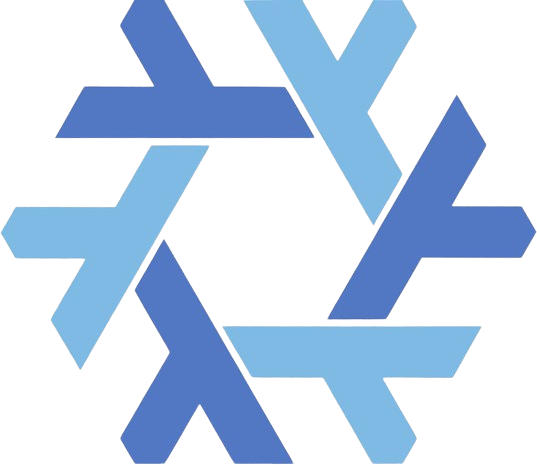
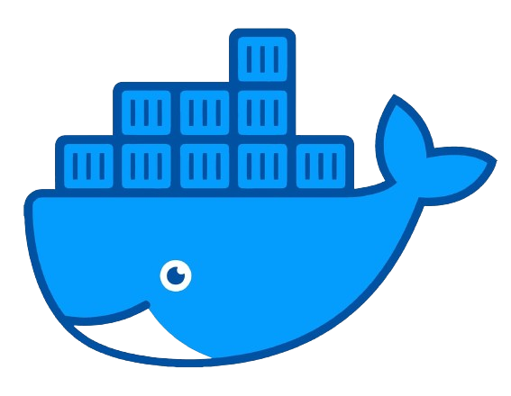

## Social media

## Projects and Repositories

<!---### Stable release (v1.1.0)

    

### Le Frata -tb &nbsp;

<a href="https://github.com/alexandreboutrik/lefrata-tb">Le Frata (-tb)</a> is a fork of a simple game project I developed at college with friends using the ncurses library. This fork aims to migrate the TUI from ncurses to termbox, a better and more versatile alternative.

--->

### Alpha release (v0.1.2-alpha)

    

### Bouclier Bleu &nbsp;&nbsp;,&nbsp;

<a href="https://github.com/alexandreboutrik/bouclier-bleu">Bouclier Bleu</a> is a modular Next-Generation Antivirus (NGAV) / Endpoint Detection and Response (EDR) system for Linux. It leverages eBPF (BPF LSM) in kernel-space and memory-safe Rust for userland. Its primary goals are to prevent ransomware and stop memory corruption (overflows/exploits).

 

---

### (PAUSED) Early development phase (pre-alpha)

    

### Homburg &nbsp;&nbsp;,&nbsp;

<a href="https://github.com/alexandreboutrik/homburg">Homburg</a> is a backend solution for creating and managing forum platforms. It features a proof-of-concept authentication system that utilizes asymmetric post-quantum cryptography instead of traditional IDs and passwords, ensuring robust protection against spoofing attacks, including those originating from admins.

---

<!---

### Learning purposes

    

### DSA and Maratona-src &nbsp;&nbsp;&nbsp;&nbsp;

Both <a href="https://github.com/alexandreboutrik/dsa">dsa</a> and <a href="https://github.com/alexandreboutrik/maratona-src">maratona-src</a> repositories have learning purposes. I use them to learn more about competitive programming, data structures, algorithms and new languages (by solving problems in that language).

--->

## Organizations

### (FORMER) Research group

    

### PQC Group (Post-Quantum Cryptography at UTFPR-TD)

The mission of <a href="https://pqc-group-utfpr.github.io/index.html">this research group</a> is to contribute to Post-Quantum Cryptography (PQC) by studying concepts, applications and adoption strategies, focusing on - but not restricted to - the development and evaluation of PQC in network protocols.  
I worked on the <a href="https://pqc-group-utfpr.github.io/projects.html">BBPQ</a> project. 

---

## Technologies

### Languages:

| C99 | Ada | Rust | Go | Python | Haskell | Fasm | Vue | Svelte |
|:---:|:---:|:----:|:--:|:------:|:-------:|:----:|:---:|:------:|
|  |  |  |  |  |  |  |  |  |

<!---
### OS:

| Gentoo | OBSD | NixOS |
|:------:|:----:|:-----:|
|  |  |  |

### Other:

| Django | AdaWS | Gin | Git | PSQL | Docker |
|:------:|:-----:|:---:|:---:|:----:|:------:|
|  |  |  |  |  |  |
--->

---

### Github stats:

    
&nbsp;
&nbsp;
    

