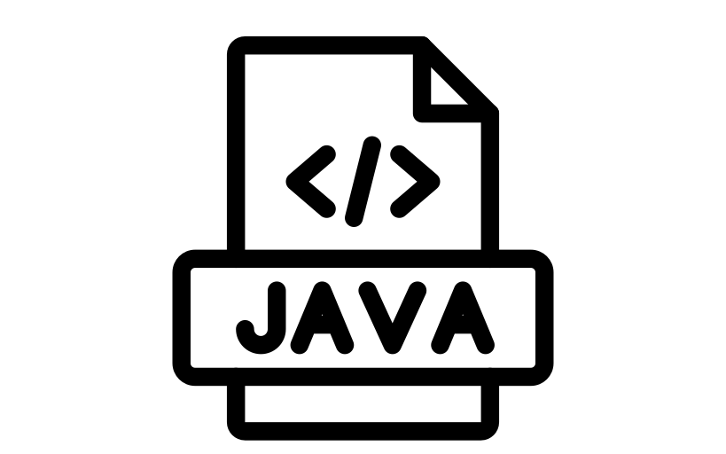
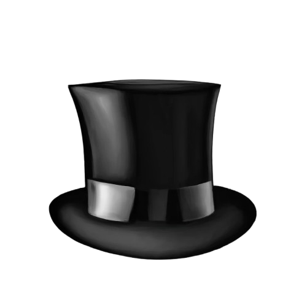

## Social media

## Projects and Repositories

### Bouclier Bleu (alpha) &nbsp;&nbsp;·&nbsp;

    

<a href="https://github.com/alexandreboutrik/bouclier-bleu">Bouclier Bleu</a> is a modular Next-Generation Antivirus (NGAV) / Endpoint Detection and Response (EDR) system for Linux. It leverages eBPF (BPF LSM) in kernel-space and memory-safe Rust for userland. Its primary goals are to prevent ransomware, stop exploits (such as memory corruption and race conditions), and reduce the system's attack surface.

 

### jfabe &nbsp;

    

<a href="https://github.com/alexandreboutrik/jfabe">jfabe</a> is a Java library for Fast Ciphertext-Policy Attribute-based Encryption (CP-ABE). Designed with decentralized and distributed systems in mind, it is production-ready, offering CCA (Chosen Ciphertext Attack) security using AEAD-backed KEM transforms.

 

<!---
### [Paused] Homburg (pre-alpha) &nbsp;&nbsp;·&nbsp;

    

<a href="https://github.com/alexandreboutrik/homburg">Homburg</a> is a backend solution for creating and managing forum platforms. It features a proof-of-concept authentication system that utilizes asymmetric post-quantum cryptography instead of traditional IDs and passwords, ensuring robust protection against spoofing attacks, including those originating from admins.

 
--->

## Technologies

### Languages:

| C99 | Ada | Rust | Go | Java | Python | Haskell | Fasm | Vue | Svelte |
|:---:|:---:|:----:|:--:|:----:|:------:|:-------:|:----:|:---:|:------:|
|  |  |  |  |  |  |  |  |  |  |

 

### Github stats:

    
&nbsp;
&nbsp;
    

