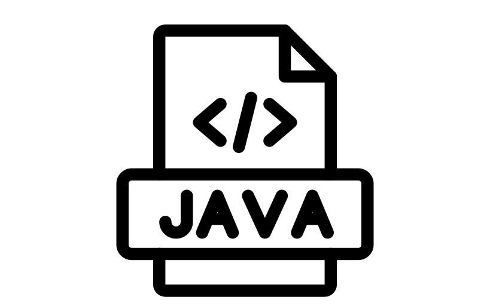
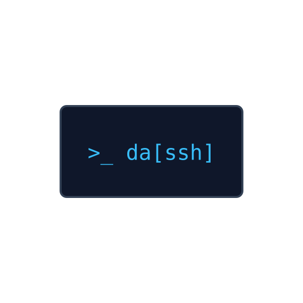
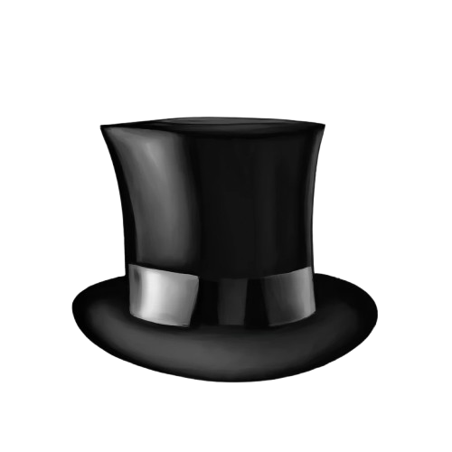

## Social media

## Projects and Repositories

### Bouclier Bleu &nbsp;<kbd></kbd>&nbsp;·&nbsp;<kbd></kbd>

<table>
    <tr>
        <td width="128" height="128" align="center" valign="middle">
            
        </td>
        <td valign="middle">
            <a href="https://github.com/alexandreboutrik/bouclier-bleu">Bouclier Bleu</a> is a modular Next-Generation Antivirus (NGAV) / Endpoint Detection and Response (EDR) system for Linux. It leverages eBPF (BPF LSM) in kernel-space and memory-safe Rust for userland. Its primary goals are to prevent ransomware, stop exploits (such as memory corruption and race conditions), and reduce the system's attack surface.
        </td>
    </tr>
</table>

### jfabe &nbsp;<kbd></kbd>

<table>
    <tr>
        <td width="128" height="128" align="center" valign="middle">
            
        </td>
        <td valign="middle">
            <a href="https://github.com/alexandreboutrik/jfabe">jfabe</a> is a Java library for Fast Ciphertext-Policy Attribute-based Encryption (CP-ABE). Designed with decentralized and distributed systems in mind, it is production-ready, offering CCA (Chosen Ciphertext Attack) security using AEAD-backed KEM transforms.
        </td>
    </tr>
</table>

### dassh &nbsp;<kbd></kbd>&nbsp;·&nbsp;<kbd></kbd>

<table>
    <tr>
        <td width="128" height="128" align="center" valign="middle">
            
        </td>
        <td valign="middle">
            <a href="https://github.com/alexandreboutrik/dassh">dassh</a> is a live SSH monitoring dashboard that watches user commands and program output across multiple sessions in a real-time terminal interface. It leverages BPF (C shim) in kernel-space for event interception, paired with a Haskell worker thread in userland that sanitizes and renders the captured traffic into dedicated terminal panes.
        </td>
    </tr>
</table>

<!---
 
### [Paused] Homburg (pre-alpha) &nbsp;&nbsp;·&nbsp;

    

<a href="https://github.com/alexandreboutrik/homburg">Homburg</a> is a backend solution for creating and managing forum platforms. It features a proof-of-concept authentication system that utilizes asymmetric post-quantum cryptography instead of traditional IDs and passwords, ensuring robust protection against spoofing attacks, including those originating from admins.

 
--->

## Technologies

### Languages

<table width="100%">
    <tr>
        <td align="center" width="20%" valign="middle">
             
            Fasm
        </td>
        <td align="center" width="20%" valign="middle">
             
            C99
        </td>
        <td align="center" width="20%" valign="middle">
             
            Ada
        </td>
        <td align="center" width="20%" valign="middle">
             
            Rust
        </td>
        <td align="center" width="20%" valign="middle">
             
            Haskell
        </td>
    </tr>
    <tr>
        <td align="center" width="20%" valign="middle">
             
            Go
        </td>
        <td align="center" width="20%" valign="middle">
             
            Java
        </td>
        <td align="center" width="20%" valign="middle">
             
            Python
        </td>
        <td align="center" width="20%" valign="middle">
             
            Vue.js
        </td>
        <td align="center" width="20%" valign="middle">
             
            Svelte
        </td>
    </tr>
</table>

 

### Github stats:

    
&nbsp;
&nbsp;
    

